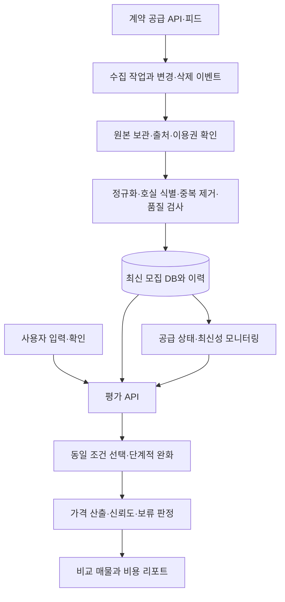

# HouseEvaluator 재설계 기획서

**도쿄·오사카·후쿠오카에서, 같은 조건의 집보다 월세가 비싼지 확인하는 서비스**

작성일: 2026-09-13 · 기획 초안 v1.0 · 대상: 일본 워킹홀리데이·취업을 준비하는 한국인

검토 기준: [specialMinority/HouseEvaluator, f8e549b](https://github.com/specialMinority/HouseEvaluator/tree/f8e549b092dfd4b97bcbe2cdc100df1713384914)

이 문서는 저장소에 확인되는 사실, 외부 공식 자료로 확인한 사실, 앞으로 검증해야 할 설계 제안을 구분한다. 아래의 표본 수·시간·오차·일정은 별도 표시가 없으면 **출시를 위한 제안값**이며 현재 성능이나 공급사의 보장 수치가 아니다.

## 1. 먼저 결정할 방향

HouseEvaluator의 핵심 기능을 **“현재 모집 중인 유사 매물의 월세+관리비와 비교하고, 근거와 불확실성을 보여주는 것”**으로 정한다. 집의 전반적인 좋은 정도를 나타내는 종합 A/B/C/D 등급은 주기능에서 제외한다. 월세가 저렴한 것과 내가 살기 좋은 집인 것은 서로 다른 판단이기 때문이다.

사용자가 제안한 **동일 조건 우선 → 영향이 작은 조건부터 완화**는 타당한 출발점이다. 다만 방향·구조·연식 등의 영향 순서는 도시와 매물 유형에 따라 달라지므로 전국 공통 고정 순위로 확정하면 안 된다. 처음에는 보수적인 허용 범위를 쓰고, 확보한 실제 매물로 완화 순서와 오차를 검증한다. 중요한 조건을 계속 삭제해 억지로 가격을 내는 대신, 비교가 성립하지 않으면 판단을 보류한다.

운영의 가장 중요한 전제는 **제휴·계약으로 사용할 권리를 확보한 모집 매물 데이터**다. 외부 사이트의 정책 변경과 차단에 전혀 영향을 받지 않는 실시간 수집은 보장할 수 없다. 공식 API도 종료·변경될 수 있다. 달성할 목표는 계약에 따른 변경 예고, 공급원 교체, 데이터 최신성 표시와 중단 기준을 통해 **변경이 생겨도 거짓 결과 없이 운영을 이어가는 것**이다.

권장 구조는 다음과 같다.

> 계약된 매물 공급 → 지속적인 신규·변경·모집 종료 반영 → 호실 단위 정규화와 중복 제거 → 사용자가 요청한 시점에 유사 매물 선택·재검증 → 가격 비교와 근거 표시

**우선 실행할 일은 크롤러의 전면 재작성보다 공급 가능성 검증이다.** 사용 가능한 데이터 계약이 성립하지 않으면 “실시간 시세 비교 서비스” 출시는 보류한다. 개발은 허가된 샘플과 합성 테스트 데이터로 진행할 수 있지만, 이것을 실제 시장 가격 판단 서비스로 공개하지 않는다.

## 2. 저장소 전체 검토 결과

### 2.1 검토 범위와 한계

- 현재 공개 브랜치 `main` 1개, 커밋 24개, 추적 파일 316개를 목록화했다. 내용 해시 기준으로 서로 다른 파일 내용은 202개이며, 이미지 5개를 포함한다.
- 백엔드·프론트엔드·스크립트, 요구사항, 에이전트 산출물, 세 버전의 사양 묶음, GoldenInputs, 벤치마크 CSV/JSON, 통합 보고서, 저장된 HTML 및 이미지를 검토했다. 중복 사양은 해시 비교와 버전 차이로 확인하고, 큰 데이터·HTML은 구조 파싱과 내용 검사를 병행했다.
- 24개 커밋의 변경 이력과 주요 기능의 수정 흐름을 확인했다. GitHub의 전체 상태 이슈 및 PR 조회 결과는 각각 0건이었다.
- 현재 배포 서버 설정·운영 로그·계약·실사용 성능은 저장소만으로 확인할 수 없다. 과거 HTML을 현재 사이트 동작의 증거로 사용하지 않았고, 운영 사이트의 대량 수집을 재실행하지 않았다.
- 기존 백엔드 테스트는 로컬 Python 3.14.2에서 라이브 수집을 끄고 실행하여 **54개 통과**했다. 이것은 기존 코드의 회귀 검증 결과이며, 오늘의 사이트 접근 가능성이나 실제 시세 정확도를 검증한 결과가 아니다.

파일별 목록은 같은 폴더의 `repository_inventory.json`, 세부 근거는 `backend_audit.md`, `spec_history_audit.md`, `frontend_scripts_audit.md`에 남겼다.

### 2.2 사용자 문제와 실제 구현의 연결

| 문제 | 저장소에서 확인한 내용 | 재설계에 반영할 결정 |
|---|---|---|
| 사이트 변경으로 수집 중단 | SUUMO·CHINTAI·HOME'S의 HTML/URL에 의존. 파서·URL·시간 제한 관련 수정을 반복 | 계약된 데이터 인터페이스를 운영의 기본 경로로 전환 |
| 미리 만든 목록의 정확성 부족 | 현재 원본 1,369행은 개별 호실 목록이 아니라 지역·평면·구조별 요약값. 그중 440행은 `estimated_from_rc` | 오래된 요약표를 현재 비교 매물로 취급하지 않음 |
| 같은 조건 매물 확보 | 이미 여러 provider와 조건 완화가 있음. 다만 중요한 조건이 일찍 완화되고 공급원별 동작이 다름 | 하나의 공통 비교 엔진에서 조건·완화·품질을 통제 |
| 실시간 대표가격의 타당성 | 공통 집계는 n≥3에서 기본적으로 `(최소+최대)/2`. 극단적 분포일 때만 median으로 전환 | 관측 매물의 중앙값을 기본값으로 사용 |
| 신뢰도 표시 | 정적 경로의 집계 행 수와 실제 독립 매물 수가 다름. 실시간은 날짜 미상·오래된 표본이 남을 수 있음 | 고유 호실·건물 수, 최신성, 누락, 완화 정도를 따로 표시 |
| 한국인 대상 서비스 | 한국어 UI·일본어 계약 항목·비용 분해는 존재. 외국인 초기비용 +1개월 완화는 상수 | 실제 청구 항목을 보여주고 근거 없는 국적별 허용 비용은 제거 |
| 세 도시 지원 | 도쿄·오사카 및 일부 수도권 데이터가 있으나 후쿠오카는 없음 | 후쿠오카 데이터·주소·역·검증 케이스를 별도 구축 |

코드 근거: [공통 실시간 집계](https://github.com/specialMinority/HouseEvaluator/blob/f8e549b092dfd4b97bcbe2cdc100df1713384914/backend/src/live_aggregate.py), [정적 비교 엔진](https://github.com/specialMinority/HouseEvaluator/blob/f8e549b092dfd4b97bcbe2cdc100df1713384914/backend/src/benchmark_matcher.py), [데이터 원본](https://github.com/specialMinority/HouseEvaluator/blob/f8e549b092dfd4b97bcbe2cdc100df1713384914/agents/agent_D_benchmark_data/out/benchmark_rent_raw.json), [변경 기록](https://github.com/specialMinority/HouseEvaluator/blob/f8e549b092dfd4b97bcbe2cdc100df1713384914/context.md).

### 2.3 신뢰도를 떨어뜨린 구체적인 원인

**① 기획과 구현의 목적이 달라졌다.** 최초 R0는 수도권 1R/1K의 종합 평가를 목표로 하며 자동 수집·실시간 가격 조회를 비목표로 적었다. 이후 실시간 비교를 추가했지만 기존 점수·문구·데이터 구조를 유지했다. 새 요청을 충족하려면 기획의 기준 문서부터 교체해야 한다. [최초 요구사항](https://github.com/specialMinority/HouseEvaluator/blob/f8e549b092dfd4b97bcbe2cdc100df1713384914/R0_Requirements.md)

**② 기록의 “929행 실매물 중앙값” 설명이 현재 데이터와 맞지 않는다.** 현재 1,369행 중 추정 440행은 약 32.1%다. 나머지 929행도 개별 호실 929개라는 뜻이 아니다. 지역·구조별 통계의 수를 현재 비교 매물 수로 표현하면 안 된다. 수집 스크립트의 `count`와 `confidence`를 병합의 정규 필드 목록에서 보존하지 않는 문제도 있다. [README](https://github.com/specialMinority/HouseEvaluator/blob/f8e549b092dfd4b97bcbe2cdc100df1713384914/README.md), [추정 생성](https://github.com/specialMinority/HouseEvaluator/blob/f8e549b092dfd4b97bcbe2cdc100df1713384914/scripts/estimate_missing.py), [병합 필드](https://github.com/specialMinority/HouseEvaluator/blob/f8e549b092dfd4b97bcbe2cdc100df1713384914/scripts/merge_benchmark_rows.py#L16)

원본을 나누면 포털 시세 요약 494행 + 수집 목록의 중앙값 435행 + RC 기반 추정 440행이다. 개발 기록의 93.1%는 추정을 포함한 구조 조합 채움률(875/940)이며, 직접 수집한 조합은 435/940=46.3%다. 이 값들을 실매물 커버리지나 정확도라고 표현하면 안 된다. 저장된 LIFULL HTML 18개도 모두 빈 파일이어서 파서 회귀 증거로 사용할 수 없다. 자세한 집계는 `spec_history_audit.md`에 남겼다.

**③ 실시간이어도 대표가격이 왜곡될 수 있다.** 예를 들어 80,000·81,000·82,000·83,000·150,000엔의 중앙값은 82,000엔이지만 최솟값·최댓값 평균은 115,000엔이다. 현재 집계의 극단값 안전장치 `max/min > 2`에 걸리지 않는 예시다. 100,000엔인 집의 판단이 반대로 바뀔 수 있다. 이 숫자는 문제를 설명하기 위한 합성 예시다. [집계 코드](https://github.com/specialMinority/HouseEvaluator/blob/f8e549b092dfd4b97bcbe2cdc100df1713384914/backend/src/live_aggregate.py)

**④ 신뢰도 높은 비교에 필요한 원본과 시점이 부족하다.** `source_updated_at`을 수집일로 채우는 수집 코드가 있고, UI는 해당 비교 집합의 날짜가 없으면 전체 정적 데이터의 가장 최근 날짜로 대체한다. 수집 성공 시각·게시 정보 갱신 시각·모집 상태 확인 시각을 구분해야 한다. [수집 날짜 대입](https://github.com/specialMinority/HouseEvaluator/blob/f8e549b092dfd4b97bcbe2cdc100df1713384914/scripts/collect_chintai_structure_benchmarks.py#L209), [UI 날짜 대체](https://github.com/specialMinority/HouseEvaluator/blob/f8e549b092dfd4b97bcbe2cdc100df1713384914/frontend/src/ui/benchmarkSection.js#L73)

**⑤ 화면이 실제 계산보다 확신을 준다.** 로딩 단계는 서버 진행률이 아니라 타이머로 움직인다. 대표가격을 midrange로 계산해도 로딩 문구는 중위수 계산이라고 표시한다. 요약의 시세 범위는 ±1%인데 비용 카드에서는 ±10% 안쪽을 시세 수준이라고 표현한다. 필수 불리언을 미입력 시 `true`로 두어 욕실 분리 여부를 확인하지 않고 입력할 수도 있다. [로딩 타이머](https://github.com/specialMinority/HouseEvaluator/blob/f8e549b092dfd4b97bcbe2cdc100df1713384914/frontend/src/ui/loadingOverlay.js#L463), [요약 기준](https://github.com/specialMinority/HouseEvaluator/blob/f8e549b092dfd4b97bcbe2cdc100df1713384914/frontend/src/ui/resultView.js#L25), [카드 기준](https://github.com/specialMinority/HouseEvaluator/blob/f8e549b092dfd4b97bcbe2cdc100df1713384914/frontend/src/ui/scoreComponents.js#L130), [기본값](https://github.com/specialMinority/HouseEvaluator/blob/f8e549b092dfd4b97bcbe2cdc100df1713384914/frontend/src/ui/formView.js#L445)

## 3. 제품 범위와 사용자의 질문

### 3.1 핵심 질문

“이 집은 **현재 확인 가능한 비슷한 모집 매물**에 비해 월세와 관리비가 높은 편인가? 그렇게 판단한 집들은 무엇이며 어떤 조건이 달랐는가?”

서비스는 모집가격을 비교한다. 실제 성약가격, 감정평가액, 계약 가능 보장으로 표현하지 않는다. 계약이 끝난 집의 월세와 신규 모집 월세도 같은 모집단에 섞지 않는다.

### 3.2 목표 지역과 범위

제품의 목표는 세 도시 모두를 지원하는 것이다. 첫 검증 범위는 **도쿄 23구·오사카시·후쿠오카시**로 제안한다. 이는 도쿄도·오사카부·후쿠오카현 전체 지원을 의미하지 않는다. 공급 계약의 실제 커버리지에 따라 구·역 생활권별 공개 범위를 표시한다.

기본 주택은 일반 장기 임대의 독립 주거 1R/1K/1DK/1LDK로 한정한다. 셰어하우스·기숙사·호텔·월단위 가구 포함 숙소·단독주택·특수 임대료 조건은 별도 시장으로 분리한다. 1R과 1K도 검증 없이 자동 병합하지 않는다.

한국인 사용자를 위한 설명은 계약서 용어와 실제 비용에 집중한다. “외국인 상담 가능”, “해외 신청 가능”, “보증인 요구”, “입주일”은 제공자가 확인한 사실과 날짜를 표시한다. 국적이나 이름으로 입주 가능성을 추정하지 않는다.

### 3.3 두 가지 비교를 구분한다

| 기능 | 비교 대상 | 결과 의미 |
|---|---|---|
| 시장 가격 비교 | 조건이 비슷한 일반 모집 매물 | 확보한 공급 범위에서 상대적으로 높은지 낮은지 |
| 실제 신청 가능한 대안 | 사용자의 입주일·계약기간·해외 신청 등 필수 조건이 확인된 매물 | 지금 문의할 수 있는 후보 목록 |

외국인 입주 가능 여부가 불명확한 매물도 일반 시장 비교에는 쓸 수 있지만, “내가 계약 가능한 대안”으로 표시하지 않는다. 반대로 외국인 대응 업체의 데이터만 확보했다면 결과 제목에 그 제한을 적고 전체 시장을 대표한다고 주장하지 않는다.

## 4. 데이터 확보와 지속 운영 전략

### 4.1 현실적인 데이터 공급 우선순위

| 경로 | 활용 방향 | 계약 전 확인할 사항 | 판단 |
|---|---|---|---|
| 관리회사·원청 중개업체의 직접 피드 | 호실·가격·변경·모집 종료·신청 조건 | 비교 산출, 소비자 표시, 보관, 제공 권한과 하위 데이터 권리 | 우선 검토 |
| 데이터 제공사와의 라이선스 | 여러 업체의 모집 데이터를 통합 | 호실 단위 필드, 세 도시 범위, 재배포·통계·모델 학습 허용 | 우선 검토 |
| 포털과의 개별 제휴 | 허용된 검색·조회·상태 확인 | 실제 제공 가능한 API/피드와 당사 이용 범위 | 협상 가능성 검증 |
| 공개 HTML 수집 | 명시적으로 허용된 범위의 보조 연결 | 사용 목적·빈도·표시·저장 권한 | 사업의 필수 경로로 두지 않음 |
| 사용자가 직접 입력한 매물 | 평가 대상 정보 확보 | 단위·누락·출처 확인 | 비교군 공급을 대체하지 못함 |
| 공공 통계·연구 데이터 | 지역 맥락·방법 검증 | 신규 모집 여부, 시점, 이용 조건 | 현재 모집 비교군과 분리 |

API라는 기술 방식보다 **사용 권리·모집 종료 반영·실제 지역 커버리지**가 중요하다. 여러 포털에서 같은 원청의 정보를 받아오는 경우 공급원이 진정으로 독립적인지도 확인한다.

### 4.2 공식 자료로 확인한 범위

- Recruit의 현재 공개 Web Service 목록에서는 SUUMO 임대 매물 검색 API를 확인하지 못했다. 따라서 공개 API가 존재한다고 전제하거나, 과거 API가 폐지되었다고 단정하지 않는다. [Recruit Web Service](https://webservice.recruit.co.jp/)
- LIFULL의 기존 기업 간 데이터 연계 사례는 제휴 방식의 가능성을 보여준다. 다만 다른 회사가 연계했다는 사실이 HouseEvaluator의 이용권이나 같은 인터페이스 제공을 보장하지 않는다. 상세 공식 출처와 사례는 `data_supply_research.md`에 정리했다.
- ATBB·REINS는 업계 업무용 접근과 재사용 조건을 확인해야 한다. 중개업체가 열람할 수 있다는 이유만으로 소비자용 가격 비교 앱에 재배포할 수 있다고 가정하지 않는다.
- 국토교통성 부동산 정보 라이브러리의 거래가격·지가·지역 정보 등을 현재 임대 모집 호실 데이터와 동일시하지 않는다.

공급처별 공식 출처와 확인되지 않은 항목은 부록의 조사 메모에 보존한다. **현재 확보된 공급 계약, 견적, SLA는 없다.**

### 4.3 공급사에 전달할 요구서

아래 항목은 실제 계약 또는 제공 문서로 확인해야 한다.

1. 세 도시 각각의 활성 고유 호실·건물 수, 1R/1K/1DK/1LDK 분포, 지도상 공백, 목조/철골/RC/SRC 분포.
2. 원청·건물·호실 식별자와 중복 제거 가능성, 주소·좌표·역·전용면적·준공·층·구조·관리비·갱신 시점의 제공률.
3. 새 매물·가격 변경·모집 종료의 전달 방식, 전체 동기화와 차분, 삭제 이벤트, 장애 시 복구와 이력.
4. API 응답속도와 실제 정보의 갱신 지연을 별도 확인. 변경 발생부터 우리 DB 반영까지의 측정 가능성.
5. 소비자 화면 표시, 원문 링크, 캐시, 장기 보관, 통계 산출, 모델 학습, 다른 공급원과 병합, 한국어 번역, 상업 이용의 허용 범위.
6. 종료 예고·스키마 변경 예고·서비스 중단 시 조치, 계약 종료 후 파생 통계·백업·학습모델의 처리 조건.
7. 기본료·종량료·초과료·최소 계약기간·트래픽 제한·국외 이용·재판매 제한. 공개 가격이 없으면 견적 미확정으로 남김.
8. 제공받은 데이터를 공급사가 적법하게 다시 제공할 권한이 있는지, 원청의 별도 허락이 필요한 필드가 있는지.

### 4.4 “실시간”을 검증 가능한 표현으로 바꾼다

| 표시 상태 | 충족해야 할 조건 | 화면 표현 |
|---|---|---|
| 요청 중 재확인 | 원청의 상태 확인 의미가 계약에 정의되어 있고 이번 요청에서 실제로 재확인됨 | “방금 모집 상태 확인” |
| 지속 갱신 자료 | 피드 지연·마지막 상태 확인 시각이 공개한 허용 범위 안 | “오늘 14:05 기준 모집 정보” |
| 갱신 지연 | 허용 시간 초과 또는 공급 상태 불명 | “정보 갱신 지연 · 현재 가격 판단 보류” |
| 과거 통계 | 현 모집 여부를 확인할 수 없는 저장 자료 | “과거 참고 통계 · 현재 비교에 사용 안 함” |

처음 제안하는 운영 목표는 차분 수신 후 내부 반영 p95 15분 이내, 평가 표본의 모집 상태 확인 24시간 이내다. 이 기준도 공급 계약으로 실현 가능한지 먼저 검증한다. 하루 단위 공급만 가능하면 “매일 갱신”으로 표시한다. 우리 서버가 방금 다운로드했다고 정보 자체가 방금 갱신된 것은 아니다.

원청 변경 → 공급자 갱신 → 우리 수신 → 평가 시각을 각각 기록한다. 공급 API가 캐시를 반환한 경우는 “방금 조회 · 공급자 최종 확인 HH:MM”로 표시한다. 원청 상태 확인 시각을 모르면 수신 시각으로 대체해 24시간 기준을 통과시키지 않는다.

사전 저장 자체가 부정확성의 원인은 아니다. **예전 요약표를 계속 재사용하는 것**과 **모집 상태·가격 변경을 지속 반영하는 호실 데이터베이스**는 다르다. 후자는 매 요청마다 포털 전체를 다시 검색하지 않아도 최신의 유사 매물을 빠르게 비교할 수 있다. 순간적인 갱신 오차는 남으므로 시각과 공급 범위를 항상 함께 보여준다.

## 5. 가격에 영향을 주는 조건과 입력 설계

### 5.1 조건 사전

아래 우선순위는 기획용 초기 가설이다. 각 조건의 가격 효과를 몇 %라고 확정하거나, “남향은 언제나 비싸다”, “RC는 항상 목조보다 비싸다”처럼 적용하지 않는다. 통계국 연구에서도 면적·역거리·층·연식 등의 조건 통제와 지역별 차이를 다룬다. [통계국 조사연구](https://www.stat.go.jp/data/cpi/pdf/kenkyu1.pdf), [통계연구휘보 79호 연구](https://www.stat.go.jp/training/2kenkyu/ihou/79/pdf/2-2-796.pdf)

| 조건군 | 수집할 필드 | 비교에서의 역할 | 완화 원칙 |
|---|---|---|---|
| 시장·계약 유형 | 도시, 일반/정기차가, 장기/월단위, 가구 포함, 독립주거 여부 | 서로 다른 시장 혼합 방지 | 직접 비교에서 고정 |
| 미시 입지 | 주소·좌표·역 ID·노선·복수 역·생활권 | 같은 구 안의 가격 차이를 반영 | 동일 역권 우선, 행정구 평균으로 대체 금지 |
| 면적·평면 | 전용면적, 1R/1K/1DK/1LDK, 로프트 포함 여부 | 주거 규모의 차이 통제 | 면적은 좁은 범위부터, 평면은 원칙 고정 |
| 역 접근성 | 도보 분수·접근 역·버스 필요 여부 | 통근 접근성 차이 | 양방향 범위를 제한해 확대, 버스와 도보 구분 |
| 건물 구조 | 木造/軽量鉄骨/鉄骨/RC/SRC | 구조 차이 통제 | 도시별 검증 전 RC↔목조 병합 금지 |
| 연식·개보수 | 준공 연월, 리모델링 시점·범위 | 신축 효과·노후·개보수 차이 | 신축 별도, 오래된 집도 연식 상한만으로 매칭하지 않음 |
| 층·건물 | 해당 층·총층수·1층·지하·최상층·엘리베이터 | 방범·채광·이동 차이 | 1층/지하 등 중요 경계를 함부로 넘지 않음 |
| 건물 종류 | マンション/アパート/一戸建て | 공급사 분류와 실제 유형 | 구조로 자동 추정하지 않고 별도 기록 |
| 채광·방위 | 주개구부 방향, 코너룸, 차폐 정보 | 선호·채광 차이 | 방향 이름과 실제 일조를 동일시하지 않음 |
| 수전·설비 | 욕실/화장실 분리, 독립 세면대, 실내 세탁기, 자동잠금 | 소형 임대의 설비 차이 | 영향이 확인되면 강하게 유지 |
| 기타 조건 | 발코니, 택배함, 인터넷·냉난방, 반려동물 | 추가 효용 또는 비용 차이 | 보조 조건부터 개별 완화 후보로 검증 |
| 특수 가격 요인 | 기간 한정 할인, 프리렌트, 사고 고지, 임대 제한 | 싼 이유를 숨기지 않도록 구분 | 확인된 특수 조건은 별도 집합 또는 제외 |
| 정보의 시점 | 모집 상태·가격 갱신·관측·상태 확인 시각 | 현재 비교의 유효성 | 표본 부족으로 최신성 기준을 해제하지 않음 |

일본 매물의 광고 도보 시간은 실제 출근 동선·신호대기·역 내부 이동과 다를 수 있다. 표본끼리는 같은 출처 정의의 도보 시간을 쓰고, 사용자에게 제공하는 실제 통근 안내는 별도 계산으로 분리한다.

### 5.2 입력과 결측값

입력의 첫 단계는 URL·제휴 매물 ID 또는 직접 입력이다. URL 자동입력은 **허용된 연결에서만** 제공하고, 연결되지 않는 사이트는 사용자가 내용을 붙여넣거나 직접 입력할 수 있다. 문서·이미지 인식은 후속 기능으로 두되 도입 시 원문과 추출값을 사용자가 확인한다.

붙여넣은 내용은 해당 대상의 정보 추출·확인에 사용한다. 이를 공개하거나 비교군·학습 자료로 축적하는 권한은 별도로 확인한다.

가격 비교 최소 정보는 지역/역권, 월세, 관리비 상태, 전용면적, 평면, 구조, 연식, 도보 시간, 계약·상품 유형이다. 층·욕실 분리 등은 확보율에 따라 신뢰도에 반영한다. 허브역·초기비용·개인 메모는 월세 비교 자체의 필수 입력에서 분리한다.

`모름`, `없음`, `0엔`은 서로 다른 값이다. 관리비 미상은 0엔이 아니고, 욕실 정보 미상은 분리형도 일체형도 아니다. 결측값을 다른 매물과 “같은 조건”이라고 세지 않는다. 핵심 조건이 부족하면 추가 입력 요청 또는 판단 보류로 전환한다.

준공 연월을 원본으로 저장하고 연식은 평가 기준일에서 계산한다. 역명은 이름 문자열만 비교하지 않고 도시·노선·역 ID를 함께 사용한다. 주소는 일본어 원문과 정규화값을 모두 유지하고, 원문에 없는 세부 주소나 방위는 만들어 넣지 않는다.

## 6. 동일 조건 비교와 단계적 완화 알고리즘

### 6.1 두 단계로 개발한다

**1단계: 실제 유사 매물의 직접 비교.** 좁은 조건 범위에서 관측된 가격의 중앙값을 낸다. 사람에게 비교표를 보여주어 납득 가능한지 검증한다. 모델로 조건 차이를 보정하지 않으므로 구조·계약 유형·평면 등 중요한 경계를 넘지 않는다.

**2단계: 검증된 조건 보정 비교.** 도시별 학습·검증 자료가 충분해진 뒤 가격 차이를 설명하는 모델을 추가한다. 허용 범위가 넓어진 매물은 관측 가격과 보정 가격을 함께 표시한다. 충분한 검증이 없는 도시나 유형에서는 1단계를 계속 사용한다.

### 6.2 비교 절차

1. **평가 대상 정규화:** 단위·주소·역·호실·계약 유형·정보 시점을 확인한다. 핵심값 누락·상충은 먼저 수정한다.
2. **사용 가능한 모집 집합 확보:** 이용권 유효, 허용 지역, 최신 모집 상태, 가격 정의가 맞는 호실만 고른다. 매매·월단위 숙소·모집 종료 등은 제외한다.
3. **자기 매물과 중복 제외:** 평가 대상의 같은 호실이 다른 업체·URL로 올라온 경우까지 제외한다. 독립 건물 수를 확인한다.
4. **가장 엄격한 비교:** 범주형 조건은 일치시키고 면적·연식·도보는 좁은 수치 구간을 쓴다. 정말 동일한 호실 특성이 있으면 우선 사용하되, 그것만으로 표본 수를 확보할 수 있다고 가정하지 않는다.
5. **완화 후보 평가:** 오프라인 검증을 통과한 도시·유형별 정책에 따라 조건을 한 번에 하나 바꾼다. 요청 중에는 후보 수·유사도·품질을 확인한다. 현재 요청의 정답 가격을 안다고 가정해 오차를 계산하지 않는다.
6. **품질 확인 후 중단:** 목표 표본에 도달하거나 더 넓히면 의미가 훼손되는 지점에서 멈춘다. 시간 부족으로 좋은 표본을 버리지 않고 확보한 집합의 품질을 판정한다.
7. **가격과 상태 산출:** 충분하면 비교가격·분포·차이·판정, 부족하면 이유와 추가로 필요한 정보를 반환한다.

**평가 대상의 월세를 후보 검색이나 조건 완화의 기준으로 쓰지 않는다.** “입력 월세 ±20%”로 찾으면 처음부터 비슷한 가격만 모이는 순환 오류가 생긴다. 검색 정렬 역시 저가순·광고순의 상위 몇 건을 그대로 표본으로 쓰지 않는다.

### 6.3 초기 비교 범위와 완화 한계

다음 수치는 프로토타입에서 검증할 초기 설정이다. 공급량과 도시별 오차를 보고 확정한다.

| 조건 | 엄격 비교의 시작값 | 직접 비교에서 허용할 최대 범위 | 그다음 행동 |
|---|---|---|---|
| 도시·계약·상품 유형 | 동일 | 동일 | 다른 시장으로 전환하지 않고 보류 |
| 역·미시 생활권 | 같은 역 ID 및 제한된 지리 범위 | 검증된 인접 역권, 위치 차이 공개 | 광역 평균으로 대체하지 않음 |
| 평면 | 1R/1K/1DK/1LDK 각각 동일 | 동일 | 통합은 별도 검증 후 |
| 전용면적 | 대상 대비 ±max(1㎡, 5%) | ±10% | 추가 확대는 보정 모델 검증 필요 |
| 연식 | ±2년, 신축은 별도 집합 | ±5년, 신축·개보수 경계 유지 | 연식 상한만 쓰지 않음 |
| 역 도보 | ±2분 | ±5분, 이동 방식 동일 | 지리·교통 차이가 크면 보류 |
| 구조 | 정확한 구조 일치 | 정확한 구조 일치 | RC/SRC 등 병합도 검증 후 |
| 층 | 동일 층 구간, 1층·지하 별도 | 특수 층 경계를 보존하는 확대 | 확인 안 된 층은 결측 표시 |
| 설비·방향 | 알려진 값 일치 | 검증된 보조 조건 하나씩 완화 | 빠진 조건과 가격 해석의 한계 표시 |

예를 들어 초기에 `방향 → 택배함 → 면적 폭` 순서로 완화할 수는 있지만 이는 구현용 가설일 뿐이다. 어떤 도시의 1K에서 욕실 분리가 가격을 크게 좌우한다면 끝까지 유지해야 한다. **구조를 두 번째 단계에서 일괄 해제하는 정책은 채택하지 않는다.**

두 개 이상의 숫자 범위를 넓힐 때는 단계마다 전후값을 남긴다. 모든 완화 이력은 평가 ID에 저장하며 사용자에게 “남동향 일치 조건 해제, 면적 22~24㎡ → 21~25㎡”처럼 표시한다. 알려진 값과 미상값은 별도 집계한다.

### 6.4 조건의 영향 순서를 결정하는 방법

도시×평면×일반 계약 유형별로 기준 모델을 학습한다. 면적·연식·역거리의 비선형성과 구조·건물 종류·지역의 상호작용을 고려한다. 처음에는 설명 가능한 회귀/GAM 또는 정규화 회귀를 기준선으로 두고, 복잡한 모델이 실제 검증에서 개선되는 경우에만 채택한다.

조건 하나를 완화했을 때 **비교 가능 요청의 증가량**과 **검증 오차·잘못된 판정의 증가량**을 함께 계산한다. 표본이 늘어도 오차가 커지면 해당 완화는 사용하지 않는다. 단순 상관계수나 모델의 특성 중요도만으로 삭제 순서를 결정하지 않는다. 지역·연식·구조가 서로 연관될 수 있기 때문이다.

검증 기준은 미래 시점의 호실을 예측하는 과제와, 전문가가 같은 조건으로 볼 수 있는지 평가하는 과제를 함께 사용한다. 조건 순위와 허용 폭은 설정 버전으로 관리하며 실제 실패 사례가 누적되면 재검토한다.

### 6.5 보정 모델 도입 시의 가격 계산

`p_i`는 비교 매물 i의 관측 월세+관리비, `x_i`는 그 조건, `x_t`는 평가 대상 조건, `f`는 로그 월세 예측 함수로 둔다.

```text
조건 보정 가격_i = p_i × exp(f(x_t) - f(x_i))
비교 대표가격 B = 조건 보정 가격들의 가중 중앙값
대상 가격 P = rent_yen + management_fee_yen
상대 차이 Δ = (P - B) / B
```

이것은 향후 도입할 계산식이다. 현재 모델의 성능이나 계수는 없다. 모델 학습에 평가 대상의 현재 가격을 넣지 않으며, 지역·주택군이 학습 범위를 벗어나면 보정하지 않는다. 보정폭 상한을 넘는 후보는 제외하거나 판단을 보류한다. 보정폭 상한도 검증으로 정한다.

1단계에서는 보정 없이 중앙값을 사용한다. 같은 건물의 다수 호실이 표본을 지배하지 않도록 건물별 가중치 상한을 둔다. 가중치에는 유사도·정보 완전성·관측 시점의 차이를 반영할 수 있지만, 최신성 최저 기준을 통과하지 못한 매물을 가중치만 낮춰 재사용하지 않는다.

대표가격 B와 Q25/Q50/Q75, 상대가격 판정은 **동일한 최종 표본·가격 정의·가중치**로 계산한다. 모두 같은 가중치이면 일반 중앙값/분위수를 사용하고, 건물 집중 등을 조정하면 가중 중앙값/분위수임을 표시한다. 보정 모델을 쓰는 경우 판정용 분포는 보정 가격으로 계산하고, 관측 원가격 분포는 별도로 보여준다. 작은 표본의 분위수 보간 규칙까지 구현 계약에 고정한다.

## 7. 가격 지표·신뢰도·판단 보류

### 7.1 가격 정의

| 지표 | 정의 | 표시 목적 |
|---|---|---|
| 월 기본비용 | 월세 + 필수 관리비/공익비 | 표준 시장 가격 비교 |
| 추가 월 의무비용 | 보증회사 월액·필수 서포트 등, 확인된 것만 | 실제 월 지출 확인 |
| 입주 필요현금 | 입주 시 실제 청구되는 항목 합계 | 초기 자금 준비 |
| T개월 순비용 | 해당 기간에 귀속되는 월 비용 + 비환급 일회비 + 발생할 갱신/퇴거비 - 확정 할인 | 워홀 6/12개월 또는 취업 24개월 계획 비교 |
| 환급성 예치금 | 敷金 중 반환 조건이 있는 금액 | 비용과 별도로 현금 묶임·반환 불확실성 표시 |

초기 청구에 첫 달·일할 월세가 포함되어 있으면 T개월 월 비용과 중복 합산하지 않는다. 환급이 불확실한 보증금은 전액 손실이나 전액 반환으로 단정하지 않고 시나리오를 나눈다. 프리렌트는 종료 시점과 중도해지 반환 조건을 확인하고, 표준 월세와 기간별 실효 비용을 함께 표시한다.

관리비 미상인 비교 매물은 월 기본비용 표본에서 제외한다. 대상과 비교군 모두 월세만 확인 가능하면 별도의 “월세만 비교” 결과를 제공할 수 있지만 월세+관리비 결과와 섞지 않는다. 5% 관리비 추정이나 지역별 초기비용 상수를 현재 시장 관측값으로 표현하지 않는다.

### 7.2 가격을 보여주는 방식

결과 상단은 다음 순서로 구성한다.

1. “높은 편 / 비슷한 범위 / 낮은 편 / 판단 보류”.
2. 내 월 기본비용, 비교군 중앙값, 엔 차이와 % 차이.
3. 비교군의 25~75백분위 범위와 데이터 기준 시각.
4. 고유 호실 수·건물 수·직접 일치 수·조건 완화 수·출처 범위.
5. 가격에 영향을 줄 수 있는 미확인 조건 및 구체적인 비교 매물 표.

25~75백분위는 **비교 매물 가격의 가운데 50%가 있는 범위**다. “적정 가격의 95% 신뢰구간”으로 부르지 않는다. 대표가격 B 자체의 추정구간은 건물 단위 재표집 등으로 검토한다. 개별 모집가격의 예측구간은 별도로 설계한 뒤 시간·건물 분리 검증의 구간 포함률을 확인한다. 두 구간을 같은 뜻으로 표시하지 않는다. 선택 편향이 큰 공급 자료는 표본 수만 늘려도 전체 시장 대표성이 생기지 않는다.

초기 판정 규칙은 품질 기준을 통과한 집합에서만 적용한다. P가 비교군 Q75보다 높고 B보다 5% 이상 높으면 “높은 편”, Q25보다 낮고 B보다 5% 이상 낮으면 “낮은 편”, 나머지는 “비슷한 범위”로 제안한다. 5%는 제품의 최소 의미 차이에 대한 가설이며 검증 후 확정한다. 불확실성·조건 누락·공급사 차이에 따라 방향이 뒤집히면 “판단 보류”가 우선한다.

“높은 편”은 확보한 유사 모집 매물 사이에서의 상대적 위치다. 부당 가격, 허위 매물, 협상 가능한 금액이라는 뜻으로 확대하지 않는다. 모든 카드와 문구는 서버가 반환하는 하나의 판정 상태를 사용하여 ±1%와 ±10% 같은 화면 간 모순을 없앤다.

### 7.3 표본 품질 기준 초안

| 상태 | 수량·유사도 기준 초안 | 표현 |
|---|---|---|
| 비교 근거 충분 | 고유 호실 ≥20, 고유 건물 ≥10, 유효 표본 수 ≥12, 핵심 조건 충족, 해당 구간 검증 통과 | 가격 판정과 근거 표시 |
| 제한적 비교 | 고유 호실 ≥10, 고유 건물 ≥5, 유효 표본 수 ≥8, 허용 완화 범위 안, 검증 통과 | 참고 중앙값·범위만 표시, 높다/낮다 판정은 보류 |
| 판단 보류 | 위 기준 미달, 핵심값 누락, 오래된 상태, 과도한 완화, 공급 충돌, 검증 안 된 구간 | 숫자 등급·싸다/비싸다 판정 생성 안 함 |

유효 표본 수는 `n_eff = (Σw)² / Σ(w²)`로 계산한다. 호실 수가 많아도 소수 후보에 가중치가 몰리면 작아진다. 이는 건물 수 확인을 대신하지 않으므로 둘 다 관리한다. 초기 목표 수집은 20~30개, 표시 대표 예시는 최대 5~10개로 두되 실제 계산에 사용한 집합과 제외 사유를 열람할 수 있게 한다. 화면용 표본을 가격순으로 뽑아 원래 분포를 바꾸지 않는다.

신뢰도는 최저 기준을 충족하지 못하는 요소를 평균으로 덮어서는 안 된다. “표본 많음”이 “모집 종료 여부 모름”을 상쇄하지 않는다. 알고리즘 정확도와 함께 다음을 표시한다: 최신성, 유사성, 결측률, 독립성, 지역·공급 범위. 보정 모델이 검증되지 않은 구간에서는 높은 신뢰도 표시를 금지한다.

### 7.4 공급 실패 시 결과

| 상황 | 행동 |
|---|---|
| 한 공급원만 실패, 다른 독립 공급의 충분한 표본 존재 | 유효 자료로 다시 품질 판정, 제외된 공급 범위 표시 |
| 기존 캐시가 상태 확인 허용 시간 안 | 기준 시각을 표시하고 허용된 수준으로 제공 |
| 캐시도 오래됨 | 현재 비교 보류, 입력한 비용 계산만 제공 |
| 유사 매물이 적음 | 허용된 조건만 단계적 완화 후 부족하면 보류 |
| 원청의 모집 종료와 포털의 모집 중 상태가 충돌 | 충돌 호실 제외 또는 원청 확인, 최근 다운로드 순으로 임의 선택하지 않음 |
| 공급 계약이 종료됨 | 해당 데이터 사용 중단, 삭제·보관 의무 실행, 남은 공급 범위로 재판정 |

과거 지역 평균·추정표로 자동 전환한 뒤 정상적인 실시간 결과처럼 내보내는 경로는 없앤다.

## 8. 사용자 흐름과 결과 화면

### 8.1 입력 → 확인 → 비교

| 단계 | 사용자에게 보이는 내용 | 완료 조건 |
|---|---|---|
| 입력 | 도시, URL 또는 직접 입력, 원문 붙여넣기 | 지원 범위와 연결 가능 여부 확인 |
| 입력 확인 | 추출값·단위·누락·출처 표시, 틀린 값 수정 | 확인하지 않은 항목은 미상으로 유지 |
| 비교 진행 | 데이터 확인·유사 매물 선택·조건 완화의 실제 상태 | 서버 상태에 따라 갱신; 실제 정보 없는 퍼센트 금지 |
| 결과 | 상대 가격·비교 근거·최신성·보류 이유 | 어떤 자료로 무엇을 판단했는지 이해 가능 |
| 비용 계획 | 6/12/24개월 비용, 보증금, 위약금 시나리오 | 시장 가격 비교와 비용 부담을 구분 |
| 다음 행동 | 비교 원문 확인, 일본어 문의 문구 복사 | 입주 가능 여부가 확인된 대안과 일반 표본 구분 |

### 8.2 결과 예시 — 모든 숫자는 합성 설명용

```text
월세+관리비가 비교 매물보다 높은 편입니다

내 매물           100,000엔/월
비교군 중앙값     90,000엔/월
차이              +10,000엔 (+11.1%)
비교군 중앙 50%   87,000~94,000엔

현재 모집을 확인한 24개 호실 / 15개 건물
대상과 동일한 역권·1K·RC / 면적 22~26㎡
완화한 조건: 남동향 일치 → 방향 제한 없음
모집 상태 확인: 오늘 14:05~14:12
공급 범위: 제휴 관리회사 A·B의 확인 가능한 매물

[어떤 집과 비교했나요?] [확인하지 못한 조건] [총 거주비용]
```

비교 표는 원문 링크, 월세, 관리비, 면적, 구조, 준공, 역·도보, 층, 방위, 모집 상태 확인일과 대상과의 차이를 보여준다. 보정했다면 관측 가격과 보정 금액을 구분한다. 대상 호실이 비교 표에 다시 등장해서는 안 된다.

표본 부족 예시는 “같은 역권·RC·1K의 최신 매물이 4개뿐이어서 판단을 보류했습니다. 방향 조건을 넓혀도 충분하지 않았습니다.”처럼 쓴다. 부족을 사용자의 잘못으로 돌리거나, 성능이 확인되지 않은 확대 검색을 권하지 않는다.

### 8.3 한국인 사용자를 위한 범위

- 일본식 월세·관리비·敷金·礼金·保証料를 원문과 한국어로 병기한다.
- 비용 협상 문구는 확인된 청구 항목에 기반해 제공한다. 근거 없는 외국인 할증 허용이나 일정 금액 절감 보장을 하지 않는다.
- 개인의 거주 계획은 6/12/24개월 선택과 임의 기간 입력으로 받는다. 국적 자체를 가격 보정 변수로 쓰지 않는다.
- 한국 원화 표시를 추가한다면 환율 출처·기준 시각을 붙이고 계산 기준은 엔화로 유지한다. MVP 기본은 엔화다.
- 모바일 360px에서 핵심 결과와 조건 차이를 읽을 수 있어야 한다. 색·등급만으로 상태를 전달하지 않는다.

## 9. 시스템 구조와 데이터 계약

### 9.1 전체 구조



초기에는 Python API, PostgreSQL/PostGIS, 비동기 작업 큐, 필요한 범위의 캐시를 제안한다. Cloud Run을 계속 사용할 수 있다. 프론트엔드를 당장 다른 프레임워크로 옮길 필요는 없다. 먼저 수집과 평가를 분리하고 계약·모델·응답 스키마를 하나로 고정한다.

### 9.2 저장 단위

| 엔터티 | 반드시 분리할 정보 |
|---|---|
| 공급 계약 | 공급자 ID, 이용 범위, 표시 필드, 저장·파생 이용 조건, 만료, 변경 예고 |
| 건물 | 건물 ID, 원문 주소·정규 주소·좌표, 구조, 준공, 총층수 |
| 호실 | 내부 호실 ID, 원청 호실 ID, 전용면적·평면·층·방위·설비 |
| 모집 조건 | 업체별 모집 ID, 월세·관리비·추가비용·계약 유형·入居可能日·캠페인 |
| 관측 이력 | 원천 갱신 시각, 수집 시각, 상태 확인 시각, 이전 값, 모집 종료 이벤트 |
| 평가 기록 | 입력·기준 시각·사용한 호실/관측 ID・제외 사유・완화 과정・버전・결과 |

한 호실에 여러 중개업체의 서로 다른 수수료·모집 조건이 있을 수 있으므로 “같은 호실”과 “같은 거래 조건”을 구분한다. 월세 시장 비교에서는 호실을 한 표본으로 세고, 신청 비용은 해당 모집 조건 기준으로 보여준다. 가격이 충돌하면 원천 우선순위와 상태 확인 절차로 해결한다.

중복 제거는 원청 ID를 우선하고, 없으면 건물·호실·층·면적·평면 등의 조합을 사용한다. **현재 월세를 호실의 영구 식별 키로 쓰지 않는다.** 가격이 바뀌어도 같은 호실이기 때문이다. 애매한 중복은 별도 묶음으로 관리하며 잘못 합쳐 다른 호실을 지우는 오류도 측정한다.

### 9.3 공통 provider 인터페이스

```text
capabilities(): 지원 도시/필드/조회·차분·종료 기능/시간 해상도
sync_changes(cursor): 신규·수정·종료 이벤트와 다음 커서
sync_snapshot(as_of): 차분 미지원 공급자의 완결된 전체 스냅숏
get_listing(id): 계약 범위 내 상세 확인
check_status(ids): 지원하는 경우에만 현재 상태 확인
health(): 오류·갱신 지연·계약 상태
```

공급 어댑터는 매물 수집과 원문 해석만 맡는다. 매물 선택·조건 완화·가격 집계는 공통 엔진에서 수행한다. 현재처럼 공급원마다 서로 다른 비교 정책이 섞이지 않도록 한다. 정규화 전에 잘못된 스키마·갑작스러운 결측 증가는 격리하고, HTTP 200을 수집 정상으로 간주하지 않는다.

전체 CSV/스냅숏은 공급자가 완결성을 확인한 정상 전달에서만 이전 자료와 대조한다. 부분 실패나 빈 응답 하나를 근거로 모든 매물을 모집 종료 처리하지 않는다. 스냅숏에서 빠진 항목의 의미도 공급 계약으로 정의하며, 부재가 곧 모집 종료를 뜻하지 않으면 별도 상태 확인 대상으로 둔다.

### 9.4 평가 API의 결과 계약

```text
assessment_id, evaluated_at, input_version
status: comparable | limited | insufficient | stale | unsupported
reason_codes, price_basis, judgment
subject_price_yen, benchmark_yen, delta_yen, delta_ratio
distribution: price_basis, weighting_method, q25_yen, q50_yen, q75_yen
sample: unit_count, building_count, effective_n, source_coverage
freshness: source_updated_at_range, status_verified_at_range
matching: exact_fields, relaxed_fields, missing_fields, steps
comparables: unit_id, observation_id, public_url, prices, differences
versions: schema, normalization, matching_policy, model, snapshot
```

`insufficient/stale/unsupported`이면 가격 판정 필드와 검증되지 않은 대표가격은 `null`로 반환한다. 시간 범위가 미상이면 미상으로 표시한다. 실제 계산에 쓰지 않은 최신 데이터셋 날짜로 대체하지 않는다. 원문 링크·호실 상세는 계약에서 허용한 필드만 반환한다.

`limited`에서는 참고 대표가격·분포를 반환할 수 있지만 `judgment=null`로 고정한다. 높다/낮다 판정은 `comparable` 상태에서만 허용한다.

초기비용만 바꾸는 시뮬레이션은 같은 `assessment_id`의 비교군과 가격을 고정해서 비용만 다시 계산한다. 그때마다 검색해 비교 기준까지 바뀌면 절감 효과를 설명할 수 없기 때문이다. 다만 저장 결과가 만료되면 먼저 갱신 필요를 표시한다.

### 9.5 장애와 보안

재시도 횟수·전체 시간 예산·동시 요청 수·공급자별 회로 차단을 공통화한다. 빈 페이지는 검색 끝과 파싱 오류를 구분하며 이미 모은 표본을 보존한다. 캐시는 조건·도시·규칙 버전·데이터 버전을 키로 하고 가격 변경·모집 종료·계약 종료 시 무효화한다.

URL 입력 기능은 정확한 허용 호스트·스킴 검사, 리디렉션마다 재검사, 사설·내부 IP 차단, 크기·시간 제한을 적용한다. 현재 서버의 저장소 루트 정적 제공은 공개 frontend/assets로 제한한다. 이 항목은 저장소에서 확인된 공개 전 수정 과제이며 일반적인 보안 경고를 덧붙인 것이 아니다. [서버](https://github.com/specialMinority/HouseEvaluator/blob/f8e549b092dfd4b97bcbe2cdc100df1713384914/backend/src/server.py), [URL 파서](https://github.com/specialMinority/HouseEvaluator/blob/f8e549b092dfd4b97bcbe2cdc100df1713384914/backend/src/suumo_url_parser.py)

개인 메모·계약서 원본은 기본적으로 서버에 장기 보관하지 않는다. 평가 재현에 필요한 자료도 공급 계약과 사용자 보관 설정 범위 안에서 저장한다. 계약 종료 시 원본뿐 아니라 파생 통계·백업·모델 처리 의무도 반영한다.

## 10. 기존 코드의 재사용과 교체 계획

기존 프로젝트를 모두 폐기할 필요는 없다. 입력·비용 계산·한국어 설명은 유지할 가치가 있고, 비교 데이터와 판단 엔진은 구조 변경이 필요하다.

| 기존 파일/영역 | 결정 | 구체적인 작업 |
|---|---|---|
| `frontend/src/ui/formView.js` | 개편하며 재사용 | 확인 화면, 미상값, 세 도시, URL 연결 범위, 가격 평가 필수값 정리 |
| `frontend/src/ui/resultView.js`·`benchmarkSection.js` | 결과 구조 교체 | 종합 점수 대신 가격 차이·분포·개별 비교표·시점·보류 사유 우선 |
| `frontend/src/ui/loadingOverlay.js` | 동작 교체, 자산은 선택 재사용 | 타이머 단계 제거, 실제 처리 상태 또는 단순 대기 표시 |
| `evaluate.py`의 비용 계산 | 분리하며 재사용 | 시장 월액·초기 현금·기간별 순비용을 별도 서비스로 분리 |
| `scoring.py`·`rules/jsonlogic.py` | 보조 기능으로 유지 | 검증된 계약 설명 규칙에 활용, 시세의 증거 없는 중립 점수 제거 |
| `live_benchmark.py` | 역할 변경 | 순차 크롤러 호출에서 계약 공급·상태 확인 조정 계층으로 변경 |
| `suumo/chintai/homes_scraper.py` | 운영 의존성 축소 | 허용된 어댑터에 필요한 추출 코드만 이관, 비교 정책은 공통화 |
| `live_aggregate.py` | 교체 | 중앙값·가중치·분포·표본 수 산출을 명시적인 계약으로 구현 |
| `live_quality.py` | 원칙 재작성 후 일부 재사용 | 오래된 표본 복원 금지, 자기매물·건물 집중·중복 품질 반영 |
| `station_utils.py`·`url_resolver.py` | 코드 기반 정규화로 변경 | 小岩/新小岩, 大阪/新大阪, 淀川区/東淀川区 오인 회귀 방지 |
| `benchmark_loader.py`·`benchmark_matcher.py` | 현재 비교 경로에서 분리 | 정적 집계·추정치에 대한 과거 참고 기능만 별도 유지 가능 |
| `backend/src/server.py` | 운영 API로 교체 | 비동기 작업, 입력·URL 제한, 공개 정적 경로 제한 |
| `S1/S2/C1/D1`, `V0`, 스키마 | v2 기준으로 통합 | 정본 1곳에서 API·폼·스냅숏 생성, 충돌 시 조용한 fallback 대신 검출 |
| GoldenInputs·기존 테스트 | 올바른 요구로 재정의 | 과거 잘못된 계산의 출력값을 그대로 정답으로 보존하지 않음 |
| `scripts/collect_*`, `merge_benchmark_rows.py` | 수집/정규화 작업으로 재구성 | 출처·샘플수·시각·추정 여부를 잃지 않는 데이터 계약 |
| 저장 HTML·이미지·진단 스크립트 | 개발 자료로 분리 | 빈 fixture 제거 또는 교체, 테스트 자산과 운영 자산을 구분 |

현재 v0.1.2에서도 개별 S1과 묶음에 들어간 S1이 달라 실제 400 오류를 일으킨 기록이 있다. 새 스키마는 입력·응답·설정·문구를 하나의 버전 규칙으로 관리한다. 생성 산출물과 소스의 해시가 다르면 CI에서 실패하게 한다. [해당 수정 기록](https://github.com/specialMinority/HouseEvaluator/blob/f8e549b092dfd4b97bcbe2cdc100df1713384914/context.md#L498)

## 11. 정확도와 운영 검수 계획

### 11.1 무엇을 검증하는가

기존 54개 테스트 통과는 출발점이다. 새 서비스에서는 **데이터가 맞는가 → 비교 대상이 비슷한가 → 가격 요약과 판정이 안정적인가 → 실패할 때 정직하게 보류하는가**까지 검사한다.

실제 거래 가격을 보유하지 않은 상태에서 “적정 월세 정답 정확도 95%”를 주장하지 않는다. 아래의 가격 오차는 알려진 모집가격을 가리고 유사 자료로 예측했을 때의 오차다. 계약 결과의 적정성을 보증하는 척도가 아니다.

### 11.2 검증 자료와 분할

- 계약 허용 범위의 실제 호실과 수작업 확인 기록을 사용한다. 추정표·합성 데이터는 계산/예외 테스트에만 쓰며 정확도 측정에서 제외한다.
- 도시·역권·구조·평면·연식·면적대별로 표본을 나눈다. 자주 조회될 구간과 데이터가 적은 구간을 모두 포함한다.
- 같은 건물·같은 호실의 중복 광고와 반복 관측을 학습·검증 양쪽에 나누지 않는다. 먼저 시간 순서를 지키고 건물 단위 분리를 적용한다.
- 미래 데이터를 과거 평가에 섞지 않는다. 평가 시점에 실제 이용 가능했던 스냅숏만 사용한다.
- 개발용 검증과 최종 보류 검증을 분리한다. 완화 순서·임계값을 최종 평가 결과에 맞추어 반복 조정하지 않는다.
- 첫 현장 검수는 도시별 핵심 필드/모집 상태 200호실, 블라인드 비교 적합성 평가 100요청 이상을 제안한다. 모집 데이터 확보와 표본 다양성에 따라 수량을 늘리고 결과의 오차 범위를 함께 보고한다.

### 11.3 출시 기준 초안

아래 기준을 도시·공개 범위별로 평가한다. 전체 평균으로 후쿠오카의 실패를 가리지 않는다. 각 측정의 분모·표본 수·기간·불확실성을 함께 기록한다.

| 영역 | 지표와 분모 | 수락 목표 초안 |
|---|---|---|
| 입력/원자료 | 원천과 대조한 핵심 필드의 정답 비율 | 98% 이상, 가격·단위 오류 별도 0건 목표 |
| 모집 상태 | 검수 시 원청과 일치하는 활성/종료 상태 비율 | 95% 이상, 확인 불가는 오답과 별도 공개 |
| 중복 식별 | 검수된 결과 안의 잔여 중복률과 잘못 병합한 비율 | 각각 2% 이하 목표, 두 오류 모두 검사 |
| 비교 적합성 | 전문가가 조건 비교에 적합하다고 판단한 후보 비율 | 90% 이상 목표, 평가자 간 불일치 기록 |
| 예측 오차 | 시간·건물 분리 검증의 모집가격 중앙 절대백분율오차 | 중앙값 10% 이내 목표, P90과 큰 오류도 공개 |
| 기준선 개선 | 단순 지역×평면 중앙값 대비 동일 검증셋 오차 | 중앙 오차 15% 이상 상대 개선 목표 |
| 판정 안정성 | 공급원 하나 제거/표본 재표집 시 높은↔낮은 판정 전환 | 충분 근거 상태에서 5% 이하 목표 |
| 비교 가능률 | 고정한 목표 사용자 요청셋 중 품질 기준 통과 비율 | 공개 범위별 70% 이상 목표; 보류율도 보고 |
| 최신성 | 원천 상태 확인 및 수신→반영 지연 | 계약한 의미의 24시간 상태 기준, 내부 반영 p95 15분 목표 |
| 응답 | 준비된 DB 평가 API의 응답 시간 | p95 3초 이내 목표; 추가 확인은 별도 처리 상태 |
| 장애 대응 | 시뮬레이션한 공급 장애·삭제·스키마 변경 | 오래된 자료를 현재로 노출하는 오류 0건 |
| 재현 가능성 | 권리상 보관 가능한 평가 기록 재계산 | 같은 입력·스냅숏·버전에서 동일 결과 |

기준선 대비 개선은 동일한 평가 가능 요청들에서 비교하고, 각 방식이 포기한 요청의 비율도 함께 보고한다. 어려운 사례를 모두 보류해 오차만 낮추는 방식은 성공으로 판단하지 않는다. 보류가 많다면 품질 기준을 낮추기 전에 공급 범위와 입력 필드를 개선한다.

모집 상태는 전체 정확도에 더해 **실제 비교에 채택한 활성 호실 중 종료·신청 중 매물이 남은 비율**, 종료 반영 지연, 전체 검수 대상 중 확인불가 비율을 보고한다. 신청 중의 취급은 상태 계약에 고정하고, 현재 모집 확인이 불가능한 표본은 현재 비교에서 제외한다. 판정 안정성은 높은↔낮은 반전률뿐 아니라 보류를 포함한 전체 상태 전이표, B의 상대 변화량, 공급원 제거 후 비교 가능률 감소를 함께 확인한다.

### 11.4 반드시 추가할 회귀 시나리오

| 사례 | 기대 결과 |
|---|---|
| 80·81·82·83·150천 엔 합성 표본 | 대표 중앙값 82천 엔, 115천 엔을 median이라고 표시하지 않음 |
| 같은 호실이 5개 업체에 중복 게시 | 호실 1개로 집계, 업체별 계약비는 구분 |
| 평가 대상이 다른 URL로 재등장 | 자기 매물 전체 제외 |
| 동일 건물 20호실만 존재 | 20개 독립 건물처럼 높은 품질 판정하지 않음 |
| 20년 된 집과 신축만 검색됨 | 연식 상한 조건으로 무리하게 합치지 않고 보류 |
| 관리비 미상·월세 단위 万円 | 0엔 대입 금지, 엔화 정규화 및 원문 확인 |
| 小岩/新小岩·大阪/新大阪·東淀川区 | 각각 고유 코드 유지, 해당 역의 도보 시간과 연결 |
| 다음 페이지가 비어 있음·오류 | 앞에서 확보한 표본 보존 후 품질 판정 |
| 오류가 반복되는 공급자 | 전역 요청 한도·시간 예산·차단 정책 준수 |
| 원청 모집 종료·포털 정보 남아 있음 | 종료/충돌 처리, 현재 비교에서 제외 |
| 자료 날짜 미상·전부 만료 | 현재 시세 판단 보류, 정적 평균으로 성공 처리 금지 |
| 욕실·방향을 모르는 사용자 | 미상 표시, 같은 조건이라고 세지 않음 |
| 보증금·첫 달 월세 포함 초기비용 | 기간 총비용의 이중 계산 없음 |
| 사설 IP·비허용 호스트·리디렉션 URL | 서버 외부조회 차단 |
| 후쿠오카 도입 | 지원 구·역·필드·상태·비용·예외 케이스 전부 검증 |

### 11.5 지속 운영

매일 공급량·종료 이벤트·시각 결측·지연·파싱 품질·중복률을 확인한다. 매주 도시별 일부 표본과 보류 사례를 사람이 검수한다. 임계값을 넘어서는 결측 증가·가격 분포 급변·상태 오류는 해당 공급/구간의 비교를 중단하고 원인을 확인한다.

가격 분포가 바뀌었다고 곧바로 모델을 재학습하지 않는다. 실제 시장 변화인지 공급 업체 구성 변화인지 먼저 확인한다. 정상 공급 중단의 복구 목표는 내부 장애와 공급사 장애를 분리하고, 사용자에게 제공할 수 있는 범위를 상태 화면으로 표시한다.

## 12. 개발 순서·출시 게이트·비용

### 12.1 단계별 실행

일정은 **개발 1명과 데이터/도메인 검수 지원이 있고 합법적인 샘플 접근이 가능한 경우**의 작업 추정이다. 공급사 계약 협상 기간은 미확정이며 아래 개발 주수와 별도다. 성능 기준 미달 시 범위·데이터를 조정하고 다음 단계로 자동 진행하지 않는다.

| 단계 | 예상 기간 | 산출물 | 다음 단계 조건 |
|---|---|---|---|
| G0 공급 가능성 | 조사·샘플 검토 1~2주; 계약 기간 별도 | 공급 요구서, 실제 샘플, 견적, 표시 가능한 결과 예시 | 소비자 비교·표시·보관 권리, 종료/변경 공급 가능성 확인 |
| G1 데이터 기반 | 2주 | 호실·건물·모집 스키마, 수집/정규화, 품질 대시보드 | 파일럿 데이터의 핵심 필드와 중복 검증 |
| G2 직접 비교 MVP | 2~3주 | 동일 조건·제한 완화·중앙값·보류, 비교 매물 표, 비용 계산 | 자기매물·중복·날짜·조건 오류 회귀 통과 |
| G3 관찰·검증 | 최소 30일 관찰, 개발과 일부 병행 | 도시별 정확도·최신성·비교 가능률·비용 보고 | 해당 공개 구간의 출시 기준 충족 |
| G4 제한 공개 | 1~2주 | 사용자 검증, 장애 훈련, 운영 매뉴얼 | 사용자가 조건 차이·보류 이유를 이해, 운영 결함 없음 |
| G5 확장 | 공급·검증 결과에 따라 별도 | 세 도시 전체 목표 범위, 필요한 구간만 보정 모델 | 각 도시별 재검증, 신규 공급권 확인 |

계약 후 첫 제한 공개까지는 약 8~12주를 계획 범위로 두되 확정 일정으로 약속하지 않는다. 세 도시 중 일부만 먼저 통과하면 그 범위를 명시해 제한 공개하고 나머지는 준비 상태로 표시한다. **제품 목표인 도쿄·오사카·후쿠오카 지원을 한 도시로 영구 축소하는 제안이 아니다.**

### 12.2 최초 개발 백로그

| 우선순위 | 작업 | 완료 정의 |
|---|---|---|
| P0 | 데이터 공급 및 권리 검증 | 실제 제공 필드·모집 종료 처리·사용 범위·견적 문서 확보 |
| P0 | v2 단일 계약과 보류 상태 | API·폼·문구·GoldenInputs의 상태 정의 일치 |
| P0 | URL 및 정적 파일 공개 범위 수정 | 비허용 조회 차단, 공개 assets만 제공 |
| P0 | 호실 ID·자기매물 제외·시점 분리 | 중복/상태/스냅숏 재현 테스트 통과 |
| P0 | 중앙값·공통 완화·신뢰도 | 예시와 실제 검증셋에서 정의대로 산출 |
| P1 | 근거 중심 결과와 한국어 입력 확인 | 사용자가 비교 매물·조건 차이·날짜 확인 가능 |
| P1 | 6/12/24개월 비용 | 보증금·선납·위약금의 중복 없는 계산 |
| P1 | 세 도시 검증·운영 관찰 | 도시별 표본 품질·비교 가능률 공개 가능 |
| P2 | 보정 모델 | 직접 비교보다 검증 결과 개선 시 채택 |
| P2 | OCR·대안 추천·지도 | 별도 이용권과 입주 조건 확인 체계 후 도입 |

### 12.3 비용과 사업 지속성

현재 확인된 공급 견적은 없으므로 “월 몇 만 원으로 가능”이라는 숫자를 만들지 않는다. 아래 항목에 실제 계약과 파일럿 사용량을 넣어 결정한다.

```text
월 고정비 F = 데이터 기본료 + DB/기본 서버/모니터링 + 정기 검수·운영 인건비
평가당 변동비 v = 외부 상태조회·지오코딩·계산·종량 저장 비용
월 비용 C(Q) = F + Q × v + 정기 동기화 종량비 + 초과료
첫해 비용 = 초기 개발·연동·계약 검토 + 12개월 운영비 + 공급 전환 예비비
```

실제 트래픽의 1배·3배 시나리오, 캐시 사용률, 도시별 단가, 한 공급자가 빠질 때의 비용을 계산한다. 무료 소비자 서비스라면 이 비용을 지원할 예산이나 수익원이 확인되어야 한다. 유료 보고서·B2B 도구·소개 수익 등은 별도 수익화 실험으로 검토한다. 중개 수익을 도입해도 비교가격·후보 순위를 수익에 맞춰 바꾸지 않으며 제휴 여부를 표시한다.

경제성 기준이 맞지 않으면 공급 범위·공개 구간·조회량·유료 기능을 조정한다. 수익성을 맞추기 위해 허가 없는 수집이나 추정치를 현재 실매물로 표현하는 방식으로 돌아가지 않는다.

### 12.4 아직 정하지 않은 사항

기획서를 완성하는 데는 다음 항목을 임의로 확정하지 않았다. G0에서 결정한다.

- 계약 주체(개인/법인, 한국/일본)와 공급사가 요구하는 자격.
- 데이터·인프라·검수에 쓸 월 예산과 최소 계약기간.
- 도시별 첫 공개 구간과 공급사 목록.
- 공급자가 보장하는 상태 정의·최대 지연·누락 허용 기준.
- 직접 비교에 필요한 저장·표시 권한, 향후 모델 학습권의 유무.
- 초기 사용자 검증 모집과 도메인 검수 담당자.

## 13. 검토 근거와 전달 파일

### 13.1 공식 외부 자료

모두 2026-09-13에 확인했다. 사업자의 자료는 제공 기능의 존재와 이용 조건을 확인하는 자료이며 HouseEvaluator의 계약 성립을 증명하지 않는다.

| 출처 | 이 기획서에 사용한 근거 |
|---|---|
| [SUUMO 이용약관](https://cdn.p.recruit.co.jp/terms/suu-t-1003/index.html) | 상업 이용·서비스 중단·조건 변경과 관련된 공식 조건 |
| [Recruit Web Service](https://webservice.recruit.co.jp/) | 현재 공개 API 목록에서 SUUMO 임대 검색 API를 확인하지 못함 |
| [LIFULL·ITANDI 연계](https://lifull.com/news/34480/), [LIFULL·TAKUTO 연계](https://lifull.com/news/48800/) | 모집 종료 정보의 기업 간 API/데이터 연계 사례 |
| [ATBB 서비스](https://www.athome.co.jp/corporate/service/business/), [전재·공개 주의사항](https://atbb.athome.jp/yakkan/touroku_koukai.html) | 업계용 시스템과 원청 승인·공개 범위 확인 필요 |
| [CHINTAI의 제휴 앱 발표](https://www.chintai.jp/news/ne1fhr-8h950/) | 제휴 개발 사례; 당사 범용 API 이용권과는 구분 |
| [REINS FAQ](https://www.reins.or.jp/qa/) | 이용 자격과 임대 등록 범위의 한계 |
| [국토교통성 가격 정보](https://www.reinfolib.mlit.go.jp/realEstatePrices/), [API 명세](https://www.reinfolib.mlit.go.jp/help/apiManual/xit001/) | 매매가격 자료와 현재 임대 모집료의 구분 |
| [NII LIFULL HOME'S 데이터셋](https://www.nii.ac.jp/dsc/idr/lifull/) | 연구용 데이터의 시점·자격·이용 제한 |
| [통계국 2018년 조사연구](https://www.stat.go.jp/data/cpi/pdf/kenkyu1.pdf) | 면적·역거리·층·연식과 지역 차이의 고려 |
| [통계연구휘보 79호 논문](https://www.stat.go.jp/training/2kenkyu/ihou/79/pdf/2-2-796.pdf) | 복수 특성 통제와 신규 계약·계속 거주 임대료의 차이 |

### 13.2 산출물

- `HouseEvaluator_재설계_기획서.md`: 제품·데이터·알고리즘·화면·구조·검수·개발 단계의 기준 문서.
- `backend_audit.md`: 백엔드 전체 검토, 54개 테스트 결과, mock 재현, 정확한 코드 링크.
- `spec_history_audit.md`: 사양·데이터·커밋 이력, 관측/추정·중복 사양·후쿠오카 공백의 근거.
- `frontend_scripts_audit.md`: 화면·수집/병합·보조 스크립트 검토와 표시상 신뢰도 문제.
- `data_supply_research.md`: 공급 후보별 공식 출처·계약 전 질문·조사 한계.
- `repository_inventory.json`: 316개 파일의 크기·해시·중복 관계·파싱 정보.

이 단계의 산출물은 재설계 기획과 검토 근거다. 운영 코드 변경, 공급 계약, GitHub 업로드·PR, 배포는 이 문서 작성에 포함하지 않았다.
